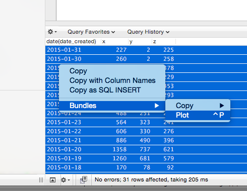
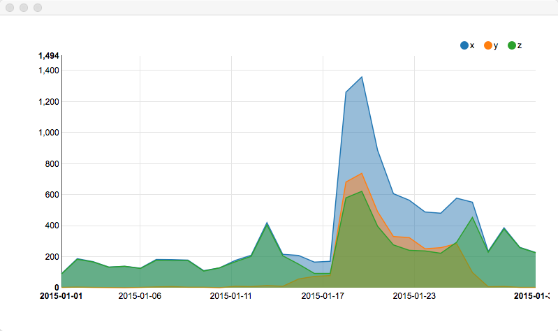

# SequelPro Plot Bundle

Plot your query results on a simple chart

First column is used as labels (x axis). The rest of columns are data series with their names used in legend. Works on selected rows only: 

# License

MIT